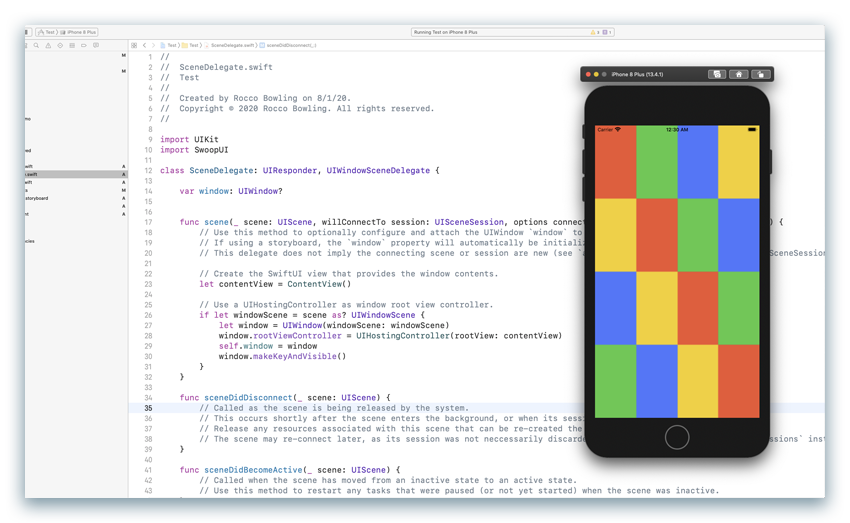

SwoopUI is a light-weight, fully concurrent, run anywhere, highly experimental drop in replacement for Swift UI.

### But, why?

SwoopUI is incredibly now so we don't have a definitive answer. However, here are some reasons we think SwoopUI will be useful:

1. **Independence**  
    SwoopUI should have no platform dependencies. We will avoid directly depending on graphical APIs like Metal/Vulkan/OpenGL. You should be use SwoopUI to draw your UI into a raw buffer on any platform Swift supports; server-side, client-side, where ever.
2. **Full Concurrency**  
    Multi-core CPUs are here in abundance.  Not only are there many cores, on Apple Silicon some cores provide different runtime characteristics (high efficiency vs high performance). SwoopUI uses [Flynn](https://github.com/KittyMac/flynn), the Actor-Model framework for Swift, to make concurrent programming easy and safe. It is our belief that a light-weight, highly-concurrent UI can be more efficient (ie use less battery) than existing UI frameworks.
3. **SwiftUI Equivalent**  
    As much as is feasible, SwoopUI should be syntactically hot-swappable with SwiftUI.  Just switch ```import SwiftUI``` to ```import SwoopUI``` and you should be good to go.


### SwoopUI (macOS)


### SwoopUI (iOS)



### SwoopUI (linux)


